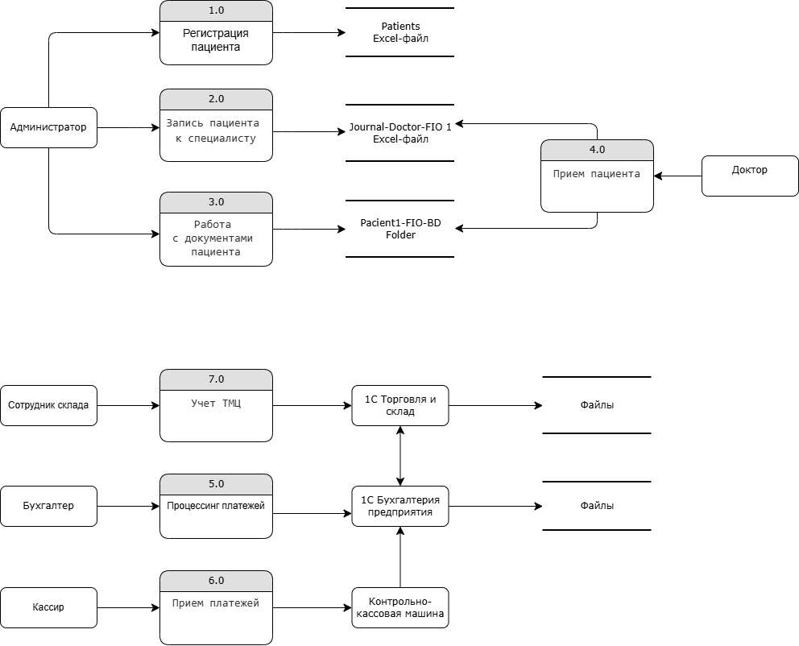

# Анализ безопасности системы

## Конфиденциальные данные, которые не учтены во внутренних системах

Персональные данные:
- Анкеты пациентов.
- Расширенная форма с данными пациентов.
- Контракт на предоставление медицинских услуг.
- Сканы документов в общей папке.

Медицинские данные
- Медицинские карты, учёт анализов ― в файлах Excel или хранят в виде сканов.

Процессы в компании:
- Регистрация пациента
- Запись пациента к специалисту
- Работа с документами пациента (сохранение в папку, разбор анализов, возможно копирование данных полученных из почты, мессенджеров)
- Прием пациента
- Учет ТМЦ
- Прием платежей
- Процессинг платежей

## Аудит мер по обеспечению безопасности данных.

- нет разгранечения видимости\доступа к данным для пользователей.
- нет защиты данных. 
- возможность редактирования файла.
- возможность удаления файла без возможности восстановления данных.
- нет мониторинга и аудита безопасности.
- ничего не сказано о защите физического доступа к серверу.
- нет регламентов по работе с конфиденциальными данными.

## Что можно улучшить

| Объект данных                                      | Методы защиты                                         |
| -------------------------------------------------- | ----------------------------------------------------- |
| ПД клиентов                                        | Шифрование, отдельное хранение|
| Медданные (результаты анализов, диагнозы, анамнез) | Токенизация, отдельное хранение, шифрование в покое  |
| Финансовые данные                                  | Шифрование, отдельное хранение|
| ПД сотрудников                                     | Шифрование, отдельное хранение|

