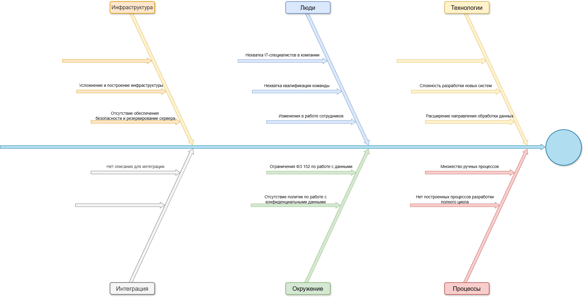

# Задание 4. Оценка узких мест при миграции

Диаграмма «Рыбья кость» (Ishikawa) для выявления потенциальных причин узких мест:

# Задание 4

| Проблемное место | Категория  | Предложенное решения | Приоритет |
| ---------------- | ---------- | -------------------- | ----------- |
| Усложнение и построение инфраструктуры | Инфраструктура | Нанять специалиста по инфраструктуре или рассмотреть вариант облачной инфраструктуры | Высокий |
| Отсутствие обеспечения безопасности и резервирование сервера | Инфраструктура | Разработка регламента и пропускного режима в серверную | Высокий |
| Нехватка IT-специалистов в компании | Люди | Найм специалистов с необходимой экспертизой | Высокий |
| Нехватка квалификации команды | Люди | Обучение для развития эксспертизы в новых технологиях | Средний |
| Изменения в работе сотрудников | Люди | Работа с сотрудниками для успешного принятия изменений | Высокий |
| Сложность разработки новых систем | Технологии | Обучение. Планирование. Проектное управление. | Высокий |
| Расширение направления обработки данных | Технологии | Развитие направление. Найм специалистов | Средний |
| Нет описания для интеграции | Интеграция | Детальная проработка протоколов | Высокий |
| Отсутствие политик по работе с конфиденциальными данными | Окружение | Разработка политик, доведение до персонала. Обучение | Высокий |
| Ограничения ФЗ 152 по работе с данными | Окружение | Детальное изучение требований. Анализ требований. | Высокий |
| Нет построенных процессов разработки полного цикла | Процессы | Применение лучших практик. | Высокий |
| Множество ручных процессов | Процессы | Изучение работы персонала. Личные беседы, опросы. Выявление скрытых знаний. Построение базы знаний  | Высокий |
